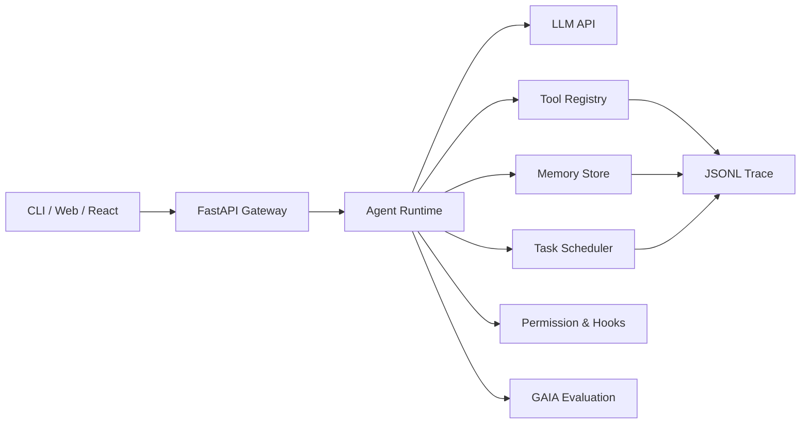

# AgentForAll

面向多业务场景的通用 Agent Runtime。

AgentForAll 将 Agent 主循环、工具调用、权限控制、Hook、Memory、任务调度和评估体系封装为可复用的执行底座，使上层业务只需关注领域逻辑与交互体验。当前项目已完成 Runtime 核心能力、GAIA 评估链路和 Streamlit 原型界面；下一阶段将使用 **FastAPI + React** 对接正式前端。

## 核心定位

- **通用 Runtime**：统一管理 `LLM -> tool_use -> tool_result -> LLM` 执行闭环。
- **模块化扩展**：Core、Tools、Hooks、Memory、Tasks、Agents、MCP 解耦设计，可按业务场景组合复用。
- **长期上下文**：基于 Markdown 维护长期记忆索引，基于 JSONL 记录会话与工具调用轨迹。
- **任务闭环**：支持任务拆解、依赖管理、状态流转、后台任务、Cron 调度和 Web 可视化。
- **能力评估**：接入 GAIA Benchmark，评估多步推理、工具使用、网页检索和文件解析能力。

## 技术栈

| Layer | Stack |
|---|---|
| Agent Runtime | Python, Anthropic Messages API, Tool Calling |
| Tooling | Bash/File/Web/PDF/Table/OCR/Task/Cron/MCP |
| Memory & Trace | Markdown, JSON, JSONL |
| Evaluation | GAIA Benchmark, pytest |
| Current UI | Streamlit |
| Next Frontend | FastAPI + React |
| Business Data | MySQL-ready |

## 架构



当前 Streamlit 用于快速验证交互与状态可视化；FastAPI + React 将作为正式产品化前端层，复用同一套 Runtime，不重写 Agent 核心。

## 前端对接规划

下一阶段将拆出标准 Web 架构：

- **FastAPI**：封装 Agent 会话、任务、Memory、工具轨迹和 GAIA 评估接口。
- **React**：实现对话工作台、任务看板、学习计划日历、Memory 管理和工具调用日志视图。
- **Streaming**：通过 SSE/WebSocket 实时展示 Agent 思考过程、工具调用状态和任务更新。
- **MySQL**：承接用户、业务任务、学习计划和评估结果等结构化数据。

## 关键能力

### Agent Runtime

`codeagent/core/loop.py` 实现主循环，负责提示词组装、模型调用、工具分发、结果回传、上下文压缩和错误恢复。

### Tool Registry

`codeagent/tools/registry.py` 将模型可见的工具 schema 与 Python handler 分离，统一接入文件、网页、PDF、表格、任务、Cron、Worktree、Subagent 和 MCP 工具。

### Permission & Hook

`codeagent/hooks` 在工具执行前后注入权限校验、日志记录和扩展逻辑，降低 Agent 误操作风险。

### Memory System

`codeagent/memory` 使用 `.memory/MEMORY.md` 维护长期记忆索引，并按上下文选择相关记忆注入每轮系统提示词。

### Task Scheduling

`codeagent/tasks` 支持任务创建、依赖管理、认领、完成、后台执行和 Cron 调度，适合学习计划、资料整理、自动化研发等长流程任务。

## GAIA 评估

项目已接入 GAIA Benchmark，支持样本过滤、严格证据模式、工具轨迹记录和官方 JSONL 格式导出。

实验记录中，GAIA Level 1：

- Exact Match：**53.20%**
- Partial Match：**34.57%**

```bash
python -m codeagent.evaluation.gaia.run_eval --level 1 --max-samples 5 --gaia-eval-mode strict
```

## 快速开始

```bash
cd AgentForAll
python -m venv .venv
# Windows: .venv\Scripts\activate
source .venv/bin/activate
pip install -r requirements.txt
```

创建 `.env`：

```env
ANTHROPIC_API_KEY=your_key_here
MODEL_ID=claude-sonnet-4-20250514

BRAVE_SEARCH_API_KEY=
TAVILY_API_KEY=
```

运行 CLI：

```bash
python -m codeagent
```

运行当前 Web 原型：

```bash
streamlit run web/app.py
```

运行测试：

```bash
pytest -q
```

## 目录结构

```text
AgentForAll
├── codeagent/
│   ├── core/        # Runtime、Agent Loop、LLM、上下文压缩
│   ├── tools/       # Tool Registry 与内置工具
│   ├── hooks/       # 权限与扩展点
│   ├── memory/      # 长期记忆与 Skill
│   ├── tasks/       # 任务、Cron、Worktree、后台执行
│   ├── agents/      # Subagent、Teammate、MessageBus
│   ├── mcp/         # MCP Client 与 Mock Server
│   └── evaluation/  # GAIA Benchmark
├── web/             # Streamlit 原型界面
├── docs/
├── skills/
└── tests/
```
